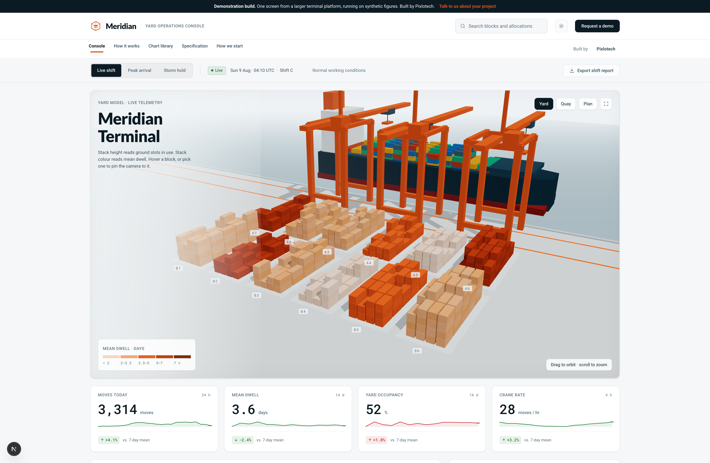

# Meridian Terminal — Yard Operations Console

A portfolio sample: an interactive 3D data console for a container terminal.
The 3D yard is not decoration sitting next to a dashboard — it *is* one of the
charts. Stack height reads ground slots in use, stack colour reads mean dwell
time, and every block in the model has a matching row in the manifest table
below it.



## What it demonstrates

- **A 3D scene driven entirely by data.** Block geometry, stack heights and
  colours are generated from the same records that fill the tables and charts.
  Switch scenario and the yard re-settles to the new figures.
- **Two-way interaction.** Hover a block in the model and its manifest row
  lights up; hover the row and the block lifts, brackets appear and a callout
  opens in 3D space. Click to pin the camera to a block.
- **Camera choreography.** Three authored views (Yard, Quay, Plan) plus a
  focus-on-block move, all eased, all interruptible by dragging.
- **Charts that follow the rules.** Categorical palette validated for
  colour-vision deficiency separation against the panel surface; one axis per
  chart; legend plus direct labels; a table view as the fallback for the one
  low-contrast step.
- **A quality floor.** Responsive to 390px, visible keyboard focus, table rows
  reachable by keyboard, `prefers-reduced-motion` respected (settle animation
  and camera easing both switch off).

## Running it

```bash
npm install
npm run dev
```

## Swapping in a Spline scene

The viewport is stage-agnostic. It renders a React Three Fiber stage by
default, and a published Spline scene when one is configured:

```bash
# .env.local
NEXT_PUBLIC_SPLINE_SCENE=https://prod.spline.design/xxxxxxxx/scene.splinecode
```

`src/components/yard/SplineStage.tsx` then takes over. The contract with the
Spline file is by object name — one object per yard block, named `Block_A1` …
`Block_B6`. On load, each object's Y scale is driven from that block's fill
ratio, and Spline's `mouseHover` / `mouseDown` events write into the same store
the R3F stage uses. Everything downstream — KPIs, charts, manifest, gate queue —
keeps working unchanged.

## Wiring real data

`src/lib/data.ts` is the only file that invents anything. Every figure is
generated from a fixed seed so the server and client renders agree and a
scenario looks the same on every reload. Replace the exported functions with
your API calls and keep the return shapes:

| Export | Feeds |
| --- | --- |
| `getBlocks` | the 3D yard, the manifest table, yard occupancy |
| `getThroughput` | moves-per-hour chart, moves-today KPI |
| `getDwellBuckets` | dwell distribution |
| `getCranes` | crane rate small multiples, crane KPI, gantry animation |
| `getGate` | gate queue |

## Layout

```
src/
  app/            page composition, type roles, design tokens
  lib/
    data.ts       synthetic telemetry + the shared scales
    console-state  one store: scenario, hover, selection, camera view
  components/
    charts.tsx    hand-rolled SVG charts (no chart library)
    panels.tsx    masthead, KPI row, manifest, gate queue
    yard/
      Scene.tsx      canvas, lights, camera rig, 3D overlays
      YardBlock.tsx  one instanced block: geometry from a data record
      Terminal.tsx   ground, water, quay cranes, the vessel at berth
      SplineStage.tsx the Spline alternative to Scene.tsx
```

## Design notes

Palette is "port daylight" — poured concrete and sea fog rather than the
default dark dashboard, with crane orange as the one loud colour. Type is
Archivo for signage-weight display, Public Sans for institutional body copy,
IBM Plex Mono for anything that is a number, an ID or a manifest line.

All figures on this page are synthetic. Meridian Terminal is not a real port.
